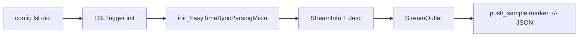

# LSLTrigger implementation review

## What works well

**Stream layout** – [get_lsl_outlet_camera_markers_stream_info](C:/Users/pho/repos/EmotivEpoc/ACTIVE_DEV/continuous_video_recorder/src/lsl_trigger.py) sets `nominal_srate=pylsl.IRREGULAR_RATE` and `channel_format=pylsl.cf_string`, which matches irregular string markers. `channel_count` is 1 vs 2 depending on `include_metadata`, aligned with the earlier bugfix described in [.cursor/plans/fix_lsl_markers_and_optimize_video_codec_cf5134b1.plan.md](C:/Users/pho/repos/EmotivEpoc/ACTIVE_DEV/continuous_video_recorder/.cursor/plans/fix_lsl_markers_and_optimize_video_codec_cf5134b1.plan.md) (samples must match channel count).

**Send path** – [send_start_marker](C:/Users/pho/repos/EmotivEpoc/ACTIVE_DEV/continuous_video_recorder/src/lsl_trigger.py) / [send_stop_marker](C:/Users/pho/repos/EmotivEpoc/ACTIVE_DEV/continuous_video_recorder/src/lsl_trigger.py) append a second string (JSON) only when both `include_metadata` and truthy `metadata` are set, so normal [ConfigLoader](C:/Users/pho/repos/EmotivEpoc/ACTIVE_DEV/continuous_video_recorder/src/config_loader.py) defaults (`include_metadata: True`) plus [main.py](C:/Users/pho/repos/EmotivEpoc/ACTIVE_DEV/continuous_video_recorder/main.py) dicts behave correctly.

**Time sync mixin** – [EasyTimeSyncParsingMixin](C:/Users/pho/repos/EmotivEpoc/ACTIVE_DEV/PhoPyLSLhelper/src/phopylslhelper/easy_time_sync.py) does not need the full app config: `init_EasyTimeSyncParsingMixin()` only initializes `_arbitrary_time_sync_points` and captures `stream_start` via LSL clock + UTC wall time. [add_lsl_outlet_info_common](C:/Users/pho/repos/EmotivEpoc/ACTIVE_DEV/continuous_video_recorder/src/lsl_trigger.py) correctly embeds that into the outlet XML. Note: that snapshot is **outlet creation time**, not per-segment recording start (`recording_start` exists on the mixin but is never called from `LSLTrigger`).

**Failure modes** – Constructor catches outlet creation errors and sets `enabled = False`. Send methods guard on `enabled` and `outlet`.

---

## Issues and edge cases

1. `**include_metadata: true` with missing/empty metadata** – If `channel_count` is 2 but the send path uses `if ... and metadata` and `metadata` is `None` or `{}`, only one string is pushed → LSL runtime error (length mismatch). Your entrypoints always pass non-empty dicts today; a defensive fix would push a second empty placeholder string when `include_metadata` is true (e.g. `"{}"`) or avoid creating a 2-channel stream until the first send (heavier).
2. **Optional import path vs annotations** – On `ImportError`, `StreamInfo` / `StreamOutlet` are never bound, but method annotations still reference `StreamInfo`. In Python 3.9 (without `from __future__ import annotations`), importing this module **without** pylsl/phopylslhelper can raise `NameError` during class body execution, so the log line “LSL triggers will be disabled” is misleading. In practice [pyproject.toml](C:/Users/pho/repos/EmotivEpoc/ACTIVE_DEV/continuous_video_recorder/pyproject.toml) declares both dependencies, so this mainly bites stripped test envs or import-order edge cases.
3. **Dead / misleading bits** – Unused imports: `datetime`, `timedelta`. The triple-quoted string under [get_lsl_outlet_camera_markers_stream_info](C:/Users/pho/repos/EmotivEpoc/ACTIVE_DEV/continuous_video_recorder/src/lsl_trigger.py) (lines 71–77) reads like commented code inside the docstring and does not document the real behavior.
4. `**close()`** – Setting `self.outlet = None` is fine (LSL releases on GC). The try/except around that is largely redundant but harmless.
5. **README vs code default** – README says `include_metadata` defaults true; [lsl_trigger.py](C:/Users/pho/repos/EmotivEpoc/ACTIVE_DEV/continuous_video_recorder/src/lsl_trigger.py) uses `.get(..., False)` on the nested `lsl` dict. That is inconsistent only if someone constructs `LSLTrigger` with a partial dict; [ConfigLoader.DEFAULT_CONFIG](C:/Users/pho/repos/EmotivEpoc/ACTIVE_DEV/continuous_video_recorder/src/config_loader.py) always supplies `True`.

---

## Verdict

The implementation **makes sense** for continuous video recording: irregular string marker stream, optional second channel for JSON metadata, and phopylslhelper time-sync fields on the stream description. No change is required for typical use. Hardening worth considering only if you care about (a) no-pylsl import without failure, or (b) strict correctness when `include_metadata` is true but callers omit metadata.