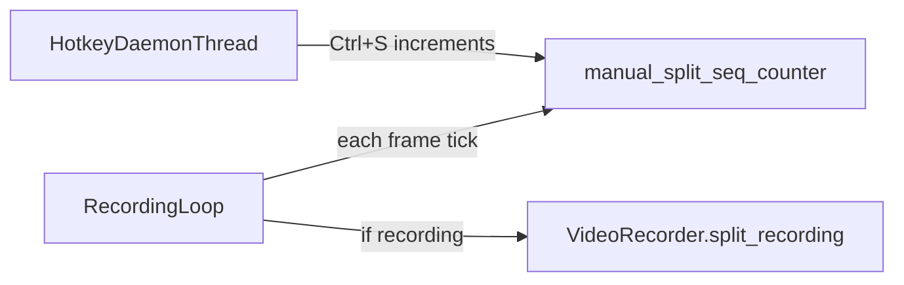

# Terminal hotkey: manual split and resume

## Context

- `[VideoRecorder.split_recording()](c:/Users/pho/repos/EmotivEpoc/ACTIVE_DEV/continuous_video_recorder/src/recorder.py)` already closes the current writer, keeps or deletes the file per `min_duration`, opens a new timestamped file, and resets duration — exactly what “split and immediately resume” requires.
- `[ContinuousVideoRecorder.run()](c:/Users/pho/repos/EmotivEpoc/ACTIVE_DEV/continuous_video_recorder/main.py)` (single-camera) already wraps auto-split with LSL stop/start markers and `reason: "auto_split"` (lines ~426–453). Manual split should mirror that with `reason: "manual_split"` (or similar).
- Multi-camera loops in `[_camera_recording_loop](c:/Users/pho/repos/EmotivEpoc/ACTIVE_DEV/continuous_video_recorder/main.py)` already call `split_recording()` for auto-split **without** LSL (lines ~285–291); manual split should behave the same per camera.
- `[UsbContinuousRecorder._handle_auto_split](c:/Users/pho/repos/EmotivEpoc/ACTIVE_DEV/continuous_video_recorder/src/usb_continuous_recorder.py)` is the right pattern for LSL + split; add a parallel `_handle_manual_split` (or generalize with a `reason` parameter) and invoke it from the run loop when the hotkey fires.
- `[examples/debut_example.py](c:/Users/pho/repos/EmotivEpoc/ACTIVE_DEV/continuous_video_recorder/examples/debut_example.py)` has no LSL on split today; manual split = `split_recording()` + user-visible print, same as the existing 1-hour split block.

## Design

- **Cross-thread signal**: Use a **monotonic counter** `manual_split_seq` protected by a `threading.Lock`, incremented on Ctrl+S. Each consumer loop compares to a per-consumer “last acknowledged” sequence:
  - **Single-camera `main`**: one `manual_split_ack_seq` on `ContinuousVideoRecorder`.
  - **Multi-camera**: each `cam_data` holds `manual_split_ack_seq` (initialized when the dict is created in `_start_multi_camera_recording`).
  - **When `manual_split_seq > ack`**: if currently writing (RECORDING/BUFFERING + `recorder.is_recording()`), perform split; then set `ack = manual_split_seq`. If not recording, still set `ack = manual_split_seq` so a keypress while idle does not force a split when recording later starts.

This avoids `threading.Event` races where one thread clears the event before others see it.

## Hotkey implementation (no new dependencies)

- Add a small module, e.g. `[src/terminal_hotkey.py](c:/Users/pho/repos/EmotivEpoc/ACTIVE_DEV/continuous_video_recorder/src/terminal_hotkey.py)`:
  - **Windows**: daemon thread polling `msvcrt.kbhit()` / `msvcrt.getch()`; treat **Ctrl+S** as byte value **0x13** (19).
  - **Unix/macOS**: only if stdin or `/dev/tty` is a TTY; put that fd in **raw mode** with `termios` + `tty`, read bytes in a loop, match `b"\x13"`; **restore terminal settings on exit** (`try`/`finally` and optionally `atexit` as a safety net).
  - If there is **no TTY** (piped/CI): do not start the thread; log once at INFO that manual split hotkey is disabled.
  - **Caveat (document in log or code comment)**: On some Unix terminals, **Ctrl+S is XOFF** and may freeze output until Ctrl+Q; Windows Terminal / modern consoles are usually fine. Default remains Ctrl+S per your preference; optional later config could switch to e.g. Ctrl+B.
- **Config** (optional but small): extend `[ConfigLoader.DEFAULT_CONFIG](c:/Users/pho/repos/EmotivEpoc/ACTIVE_DEV/continuous_video_recorder/src/config_loader.py)` with something like `hotkeys: { manual_split_enabled: true }` so CI/non-interactive runs can disable the listener without code changes.

## Code changes by file

1. `**src/terminal_hotkey.py`** (new): `start_manual_split_hotkey_thread(increment_seq: Callable[[], None], *, enabled: bool, logger)` → returns `Optional[threading.Thread]` (daemon).
2. `**[main.py](c:/Users/pho/repos/EmotivEpoc/ACTIVE_DEV/continuous_video_recorder/main.py)**` (`ContinuousVideoRecorder`):
  - In `__init__`: initialize `manual_split_seq`, `manual_split_lock`, `manual_split_ack_seq`, and optionally read `hotkeys` from `self.config`.
  - Add `_request_manual_split()` (increments seq under lock).
  - Add `_maybe_handle_manual_split_single(...)` / internal helper to **DRY** with auto-split: extract the existing LSL + `split_recording()` block into something like `_split_with_lsl(self, reason: str) -> bool` used by **both** `should_split()` path and manual path (minimal duplication).
  - `**run()`** (single camera): after starting webcam, start hotkey thread; in the main loop, immediately before or alongside the auto-split check, call manual-split handling when `self.state` is RECORDING or BUFFERING.
  - `**_start_multi_camera_recording` / `_camera_recording_loop**`: start **one** hotkey thread before spawning workers (same counter on `self`); add `manual_split_ack_seq` to each `cam_data`; in the loop, next to the existing `should_split()` block, handle manual split for that camera’s recorder/state.
3. `**[src/usb_continuous_recorder.py](c:/Users/pho/repos/EmotivEpoc/ACTIVE_DEV/continuous_video_recorder/src/usb_continuous_recorder.py)`**:
  - Same counter + ack fields on the instance; start hotkey thread at start of `run()` after successful `start_recording()`.
  - In the main `while` loop (where `_handle_auto_split` runs), call manual-split handler: mirror `_handle_auto_split` LSL pattern with `reason: "manual_split"`.
4. `**[examples/debut_example.py](c:/Users/pho/repos/EmotivEpoc/ACTIVE_DEV/continuous_video_recorder/examples/debut_example.py)**`:
  - Use a simple **Event** or the same counter pattern (Event is enough here: always recording, single thread); start hotkey thread after recording starts; in the `while True` loop, if triggered and `video_recorder.is_recording()`, call `split_recording()` and print; update startup message to mention **Ctrl+S** for split and **Ctrl+C** to stop.
5. **Docs**: One-line update to `[README.md](c:/Users/pho/repos/EmotivEpoc/ACTIVE_DEV/continuous_video_recorder/README.md)` describing manual split (Ctrl+S), TTY requirement, and Unix XOFF caveat — only if you want user-facing docs (minimal).

## Testing

- **Manual**: Run each entry point in a real console, press Ctrl+S while recording, confirm a new file appears and recording continues.
- **Automated** (light): optional unit test for “ack consumes idle press” logic with a mock recorder (no terminal), if you want regression safety without mocking TTY.

## Risk notes

- Hotkey works only when the process has an **interactive console** with keyboard focus; it will not fire from another window.
- **Multi-camera**: all cameras split on one keypress (same semantics as “split current recording” per stream).

