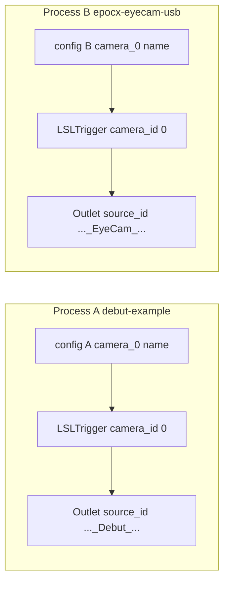

# Globally unique LSL `source_id` per camera

## Your workflow (two terminals) — **no complex multi-camera config**

Launching `[scripts/debut-example.ps1](C:/Users/pho/repos/EmotivEpoc/ACTIVE_DEV/continuous_video_recorder/scripts/debut-example.ps1)` and `[scripts/epocx-eyecam-usb.ps1](C:/Users/pho/repos/EmotivEpoc/ACTIVE_DEV/continuous_video_recorder/scripts/epocx-eyecam-usb.ps1)` starts **two separate OS processes** (`uv run …`). Each process has its own Python interpreter, its own `[LSLTrigger](C:/Users/pho/repos/EmotivEpoc/ACTIVE_DEV/continuous_video_recorder/src/lsl_trigger.py)`, and its own LSL outlet. Uniqueness across cameras is **not** solved by one app driving two cameras in threads; it is solved by **each YAML + each process** contributing a distinct identity (hostname is shared, but `webcam.camera_0.name`, optional `serial`, and `device_index` differ per config file).

You do **not** need:

- A single YAML with two `lsl` blocks, or
- Multi-camera `[main.py](C:/Users/pho/repos/EmotivEpoc/ACTIVE_DEV/continuous_video_recorder/main.py)` refactors (per-thread outlets, locks, `webcam.cameras[]` wiring)

for that workflow.

**Minimal config per camera:** keep using **one config file per recorder** (e.g. debut vs epoc eye cam). Under each file, ensure `webcam.camera_0` has distinct `**name`** (and optional `**serial`** if two devices could share a label). With `auto_source_id: true` (default), `source_id` becomes derived automatically; you can delete or ignore a static `lsl.source_id` line for new setups.

## Context (library code)

- `[src/lsl_trigger.py](C:/Users/pho/repos/EmotivEpoc/ACTIVE_DEV/continuous_video_recorder/src/lsl_trigger.py)` reads `source_id` from `config["lsl"]` today (~L75).
- `[main.py](C:/Users/pho/repos/EmotivEpoc/ACTIVE_DEV/continuous_video_recorder/main.py)` multi-camera mode still has no LSL in `_camera_recording_loop`; that only matters if you run **one** `main.py` with multiple cameras. **Follow-up / optional** if you ever need that.

## Design

### 1. New module: `src/lsl_source_id.py`

- `_sanitize_segment(s: str) -> str`: LSL-friendly token (unsafe chars → `_`, collapse, non-empty fallback).
- `compute_lsl_source_id(config: dict, camera_id: int) -> str`:
  - `hostname`: `socket.gethostname()`.
  - Per-camera block:
    - If `config["webcam"].get("cameras")` is a `list` and `camera_id < len(list)`: read `name`, `serial`, `device_index` from that element.
    - Else: `config["webcam"].get(f"camera_{camera_id}", {})`.
  - **Label**: `name` if non-empty, else `f"camera_{camera_id}"`.
  - **Third token**: `serial` if non-empty, else `device_index` from block, else `str(camera_id)`.
  - Compose `{hostname}_{label}_{third}` (sanitize each segment; one consistent join convention).

### 2. Config: `lsl.auto_source_id`

- In `[src/config_loader.py](C:/Users/pho/repos/EmotivEpoc/ACTIVE_DEV/continuous_video_recorder/src/config_loader.py)` `DEFAULT_CONFIG["lsl"]`: `**auto_source_id: true`**.
- `**auto_source_id` true**: effective outlet `source_id` = `compute_lsl_source_id(config, camera_id)` (ignore YAML `lsl.source_id` for stream identity).
- `**auto_source_id` false**: keep today’s literal `lsl.source_id`.

### 3. `LSLTrigger`

- `__init__(self, config: Dict[str, Any], camera_id: int = 0)`.
- Shallow copy `config["lsl"]` into `self.config`; if `auto_source_id`, set `self.config["source_id"]` from `compute_lsl_source_id`.
- `**threading.Lock`**: optional; only required if the **same** outlet is `push_sample`d from multiple threads. Two separate processes do not need it. Add when/if multi-camera `main.py` LSL is implemented.

### 4. Call sites (in scope)

- `[src/usb_continuous_recorder.py](C:/Users/pho/repos/EmotivEpoc/ACTIVE_DEV/continuous_video_recorder/src/usb_continuous_recorder.py)`: `LSLTrigger(self.config, camera_id)`.
- `[main.py](C:/Users/pho/repos/EmotivEpoc/ACTIVE_DEV/continuous_video_recorder/main.py)`: `LSLTrigger(self.config, camera_id=0)` for existing single-camera / shared-outlet paths only.

### 5. Multi-camera `main.py` (out of scope for this plan)

Defer: per-recorder `LSLTrigger`, LSL in `_camera_recording_loop`, shutdown of multiple outlets, push lock. Reopen if you switch to one process recording N cameras.

### 6. Optional YAML

- Comment `# serial: "optional_stable_id"` under `webcam.camera_0` in an example config if useful.

## Architecture: two Explorer windows (two processes)

## Files to touch

| File                                                                                                                                  | Change                                         |
| ------------------------------------------------------------------------------------------------------------------------------------- | ---------------------------------------------- |
| New `[src/lsl_source_id.py](C:/Users/pho/repos/EmotivEpoc/ACTIVE_DEV/continuous_video_recorder/src/lsl_source_id.py)`                 | `compute_lsl_source_id`, sanitization          |
| `[src/lsl_trigger.py](C:/Users/pho/repos/EmotivEpoc/ACTIVE_DEV/continuous_video_recorder/src/lsl_trigger.py)`                         | `camera_id`, copy `lsl` dict, auto `source_id` |
| `[src/config_loader.py](C:/Users/pho/repos/EmotivEpoc/ACTIVE_DEV/continuous_video_recorder/src/config_loader.py)`                     | `lsl.auto_source_id` default                   |
| `[src/usb_continuous_recorder.py](C:/Users/pho/repos/EmotivEpoc/ACTIVE_DEV/continuous_video_recorder/src/usb_continuous_recorder.py)` | pass `camera_id`                               |
| `[main.py](C:/Users/pho/repos/EmotivEpoc/ACTIVE_DEV/continuous_video_recorder/main.py)`                                               | `camera_id=0` only                             |

## Risks / notes

- Auto `source_id` changes stream identity vs old literal `continuous_video_recorder`; receivers can use `lsl.auto_source_id: false` to pin YAML `source_id`.
- Same hostname + same `name` + same missing serial and same `device_index` on two configs could still collide—use distinct `**name**` or set `**serial**`.

