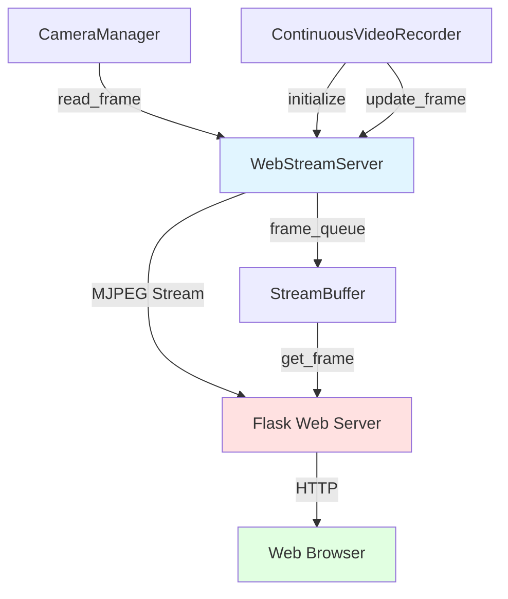
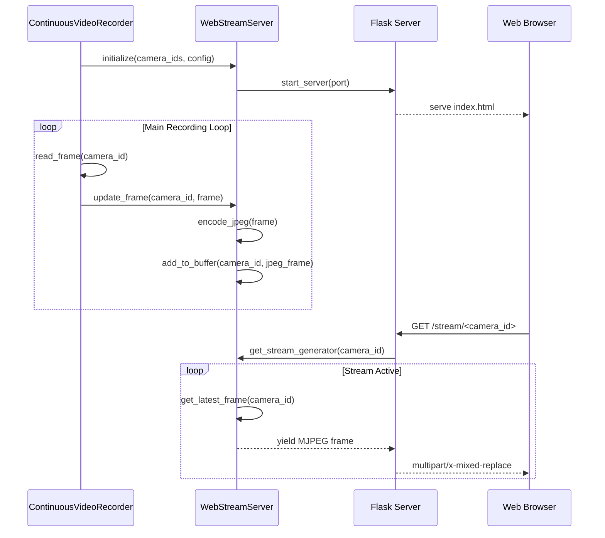

# Design Document: Web UI Stream Viewer

## Overview

This feature adds a web-based user interface to view live camera streams from the continuous video recorder application. The web UI will allow users to monitor active camera feeds in real-time through a web browser, providing an alternative to the existing PyQt6 preview windows. The implementation uses a lightweight web server (Flask) to serve video streams via MJPEG (Motion JPEG) format, enabling browser-based viewing without requiring additional plugins or complex streaming protocols.

The web UI will integrate seamlessly with the existing camera management system, reading frames from the same camera sources and providing a responsive interface that displays all active cameras with their status information.

## Architecture



The architecture consists of three main layers:

1. **Stream Capture Layer**: Integrates with existing CameraManager to capture frames from active cameras
2. **Web Server Layer**: Flask-based HTTP server that serves the web interface and video streams
3. **Client Layer**: Browser-based UI that displays live streams using MJPEG format

## Main Algorithm/Workflow



## Components and Interfaces

### Component 1: WebStreamServer

**Purpose**: Manages frame buffers for all cameras and provides stream generation for web clients

**Interface**:
```pascal
CLASS WebStreamServer
  METHODS:
    PROCEDURE initialize(camera_ids: List<Integer>, config: Dictionary)
    PROCEDURE start_server(port: Integer, host: String)
    PROCEDURE stop_server()
    PROCEDURE update_frame(camera_id: Integer, frame: Array)
    FUNCTION get_stream_generator(camera_id: Integer): Generator
    FUNCTION get_camera_status(): Dictionary
    FUNCTION is_running(): Boolean
END CLASS
```

**Responsibilities**:
- Maintain thread-safe frame buffers for each camera
- Encode frames to JPEG format for MJPEG streaming
- Generate MJPEG streams for Flask routes
- Track camera connection status and frame rates
- Provide camera metadata to web interface

### Component 2: Flask Web Application

**Purpose**: HTTP server that serves the web interface and video stream endpoints

**Interface**:
```pascal
MODULE FlaskWebApp
  ROUTES:
    ROUTE GET "/" -> serve_index_page()
    ROUTE GET "/stream/<camera_id>" -> serve_mjpeg_stream(camera_id)
    ROUTE GET "/api/cameras" -> get_camera_list()
    ROUTE GET "/api/status" -> get_system_status()
    ROUTE GET "/static/<path>" -> serve_static_files(path)
END MODULE
```

**Responsibilities**:
- Serve HTML/CSS/JavaScript files for web interface
- Provide MJPEG stream endpoints for each camera
- Expose REST API for camera status and metadata
- Handle client connections and disconnections
- Serve static assets (CSS, JavaScript, images)

### Component 3: Web UI Frontend

**Purpose**: Browser-based interface for viewing camera streams

**Interface**:
```pascal
MODULE WebUIFrontend
  COMPONENTS:
    COMPONENT CameraGrid
      PROPERTIES:
        cameras: List<CameraInfo>
        layout: GridLayout
      METHODS:
        PROCEDURE render()
        PROCEDURE update_camera_status()
    END COMPONENT
    
    COMPONENT CameraStreamView
      PROPERTIES:
        camera_id: Integer
        stream_url: String
        status: String
      METHODS:
        PROCEDURE connect_stream()
        PROCEDURE disconnect_stream()
        PROCEDURE show_error(message: String)
    END COMPONENT
END MODULE
```

**Responsibilities**:
- Display grid of camera streams
- Show camera status indicators (connected, recording, disconnected)
- Handle stream connection errors gracefully
- Provide responsive layout for different screen sizes
- Auto-refresh camera list when cameras are added/removed

## Data Models

### Model 1: CameraStreamInfo

```pascal
STRUCTURE CameraStreamInfo
  camera_id: Integer
  device_index: Integer
  resolution: Tuple<Integer, Integer>
  fps: Integer
  is_connected: Boolean
  is_recording: Boolean
  recording_mode: String
  stream_url: String
  last_frame_time: Float
END STRUCTURE
```

**Validation Rules**:
- camera_id must be non-negative integer
- resolution must be tuple of two positive integers
- fps must be positive integer
- recording_mode must be one of: "motion_detect", "usb_continuous"
- stream_url must be valid HTTP URL

### Model 2: StreamBuffer

```pascal
STRUCTURE StreamBuffer
  camera_id: Integer
  frames: Queue<ByteArray>
  max_size: Integer
  last_update: Float
  frame_count: Integer
  jpeg_quality: Integer
END STRUCTURE
```

**Validation Rules**:
- max_size must be positive integer (default: 2)
- jpeg_quality must be integer between 1 and 100 (default: 85)
- frames queue must not exceed max_size
- last_update must be valid timestamp

### Model 3: WebServerConfig

```pascal
STRUCTURE WebServerConfig
  enabled: Boolean
  port: Integer
  host: String
  jpeg_quality: Integer
  max_buffer_size: Integer
  stream_timeout: Integer
  cors_enabled: Boolean
END STRUCTURE
```

**Validation Rules**:
- port must be integer between 1024 and 65535
- host must be valid IP address or hostname
- jpeg_quality must be integer between 1 and 100
- max_buffer_size must be positive integer
- stream_timeout must be positive integer (seconds)

## Algorithmic Pseudocode

### Main Initialization Algorithm

```pascal
ALGORITHM initializeWebStreamServer(camera_ids, config)
INPUT: camera_ids (list of integers), config (dictionary)
OUTPUT: initialized WebStreamServer instance

BEGIN
  ASSERT camera_ids IS NOT EMPTY
  ASSERT config CONTAINS "web_ui" section
  
  // Step 1: Extract web UI configuration
  web_config ← config["web_ui"]
  port ← web_config.get("port", 5000)
  host ← web_config.get("host", "0.0.0.0")
  jpeg_quality ← web_config.get("jpeg_quality", 85)
  
  // Step 2: Initialize stream buffers for each camera
  stream_buffers ← EMPTY_DICTIONARY
  FOR each camera_id IN camera_ids DO
    ASSERT camera_id >= 0
    
    buffer ← CREATE StreamBuffer WITH
      camera_id = camera_id
      frames = EMPTY_QUEUE(max_size=2)
      jpeg_quality = jpeg_quality
      last_update = CURRENT_TIME()
    END WITH
    
    stream_buffers[camera_id] ← buffer
  END FOR
  
  // Step 3: Initialize Flask application
  flask_app ← CREATE Flask("web_stream_viewer")
  REGISTER_ROUTES(flask_app, stream_buffers)
  
  // Step 4: Start server in background thread
  server_thread ← CREATE Thread(
    target=flask_app.run,
    args=(host, port),
    daemon=TRUE
  )
  server_thread.start()
  
  ASSERT server_thread.is_alive()
  
  RETURN WebStreamServer WITH
    flask_app = flask_app
    stream_buffers = stream_buffers
    server_thread = server_thread
    is_running = TRUE
  END WITH
END
```

**Preconditions:**
- camera_ids is a non-empty list of valid camera identifiers
- config dictionary contains "web_ui" section with valid settings
- Port specified in config is not already in use
- Flask and required dependencies are installed

**Postconditions:**
- WebStreamServer instance is created and initialized
- Flask server is running in background thread
- Stream buffers are created for all cameras
- Server is accessible at specified host:port
- is_running flag is set to TRUE

**Loop Invariants:**
- All camera_ids in the list are non-negative integers
- Each camera_id has exactly one corresponding StreamBuffer
- All created buffers have valid configuration

### Frame Update Algorithm

```pascal
ALGORITHM updateFrame(camera_id, frame)
INPUT: camera_id (integer), frame (numpy array)
OUTPUT: success (boolean)

BEGIN
  ASSERT camera_id IN stream_buffers
  ASSERT frame IS NOT NULL
  ASSERT frame.shape HAS 3 dimensions  // height, width, channels
  
  // Step 1: Get stream buffer for camera
  buffer ← stream_buffers[camera_id]
  
  // Step 2: Encode frame to JPEG
  encode_params ← [cv2.IMWRITE_JPEG_QUALITY, buffer.jpeg_quality]
  success, jpeg_data ← cv2.imencode(".jpg", frame, encode_params)
  
  IF NOT success THEN
    LOG_WARNING("Failed to encode frame for camera " + camera_id)
    RETURN FALSE
  END IF
  
  // Step 3: Update buffer with new frame (thread-safe)
  ACQUIRE_LOCK(buffer.lock)
  TRY
    // Clear old frames if buffer is full
    WHILE buffer.frames.size() >= buffer.max_size DO
      buffer.frames.dequeue()
    END WHILE
    
    // Add new frame
    buffer.frames.enqueue(jpeg_data.tobytes())
    buffer.last_update ← CURRENT_TIME()
    buffer.frame_count ← buffer.frame_count + 1
  FINALLY
    RELEASE_LOCK(buffer.lock)
  END TRY
  
  RETURN TRUE
END
```

**Preconditions:**
- camera_id exists in stream_buffers dictionary
- frame is a valid numpy array with shape (height, width, channels)
- frame data is in BGR format (OpenCV standard)
- StreamBuffer for camera_id is properly initialized

**Postconditions:**
- Frame is encoded to JPEG format
- JPEG data is added to buffer queue
- Old frames are removed if buffer is full
- last_update timestamp is updated
- frame_count is incremented
- Returns TRUE if successful, FALSE otherwise

**Loop Invariants:**
- Buffer size never exceeds max_size
- All frames in buffer are valid JPEG byte arrays
- Buffer lock is always released after operation

### Stream Generation Algorithm

```pascal
ALGORITHM generateMJPEGStream(camera_id)
INPUT: camera_id (integer)
OUTPUT: generator yielding MJPEG frames

BEGIN
  ASSERT camera_id IN stream_buffers
  
  buffer ← stream_buffers[camera_id]
  boundary ← "frame"
  
  WHILE TRUE DO
    // Step 1: Get latest frame from buffer
    ACQUIRE_LOCK(buffer.lock)
    TRY
      IF buffer.frames.is_empty() THEN
        frame_data ← NULL
      ELSE
        // Get latest frame without removing it
        frame_data ← buffer.frames.peek_last()
      END IF
    FINALLY
      RELEASE_LOCK(buffer.lock)
    END TRY
    
    // Step 2: Handle missing frame
    IF frame_data IS NULL THEN
      SLEEP(0.033)  // ~30 FPS
      CONTINUE
    END IF
    
    // Step 3: Yield MJPEG frame with multipart headers
    headers ← "--" + boundary + "\r\n"
    headers ← headers + "Content-Type: image/jpeg\r\n"
    headers ← headers + "Content-Length: " + LENGTH(frame_data) + "\r\n\r\n"
    
    YIELD headers + frame_data + "\r\n"
    
    // Step 4: Rate limiting
    SLEEP(0.033)  // ~30 FPS
  END WHILE
END
```

**Preconditions:**
- camera_id exists in stream_buffers
- Buffer is initialized and accessible
- Client connection is active

**Postconditions:**
- Generates infinite stream of MJPEG frames
- Each frame includes proper multipart headers
- Stream maintains approximately 30 FPS rate
- Handles missing frames gracefully

**Loop Invariants:**
- Buffer lock is always released after frame access
- Each yielded frame has valid MJPEG multipart format
- Sleep interval maintains consistent frame rate

### Camera Status Retrieval Algorithm

```pascal
ALGORITHM getCameraStatus()
INPUT: none
OUTPUT: status_dict (dictionary of camera statuses)

BEGIN
  status_dict ← EMPTY_DICTIONARY
  current_time ← CURRENT_TIME()
  
  FOR each camera_id, buffer IN stream_buffers DO
    ACQUIRE_LOCK(buffer.lock)
    TRY
      // Calculate time since last frame
      time_since_update ← current_time - buffer.last_update
      
      // Determine connection status
      IF time_since_update > 5.0 THEN
        is_connected ← FALSE
      ELSE
        is_connected ← TRUE
      END IF
      
      // Build status info
      camera_status ← CREATE CameraStreamInfo WITH
        camera_id = camera_id
        is_connected = is_connected
        last_frame_time = buffer.last_update
        frame_count = buffer.frame_count
        stream_url = "/stream/" + camera_id
      END WITH
      
      status_dict[camera_id] ← camera_status
    FINALLY
      RELEASE_LOCK(buffer.lock)
    END TRY
  END FOR
  
  RETURN status_dict
END
```

**Preconditions:**
- stream_buffers dictionary is initialized
- All buffers have valid lock objects
- System time is available and accurate

**Postconditions:**
- Returns dictionary with status for all cameras
- Each status includes connection state and metadata
- All buffer locks are properly released
- Connection status reflects recent frame activity

**Loop Invariants:**
- All processed cameras have entries in status_dict
- Buffer locks are always released after access
- Connection status is based on consistent timeout threshold

## Key Functions with Formal Specifications

### Function 1: start_web_server()

```pascal
PROCEDURE start_web_server(camera_ids: List<Integer>, config: Dictionary)
```

**Preconditions:**
- camera_ids is non-empty list of valid camera IDs
- config contains "web_ui" section with valid port and host
- Port is not already in use by another process
- Flask and dependencies are installed

**Postconditions:**
- Flask server is running in background thread
- Server is accessible at configured host:port
- Stream buffers are initialized for all cameras
- Web interface is accessible via browser
- Server thread is marked as daemon

**Loop Invariants:** N/A (no loops in function body)

### Function 2: update_frame()

```pascal
PROCEDURE update_frame(camera_id: Integer, frame: Array)
```

**Preconditions:**
- camera_id exists in active stream buffers
- frame is valid numpy array with shape (H, W, C)
- frame data is in BGR color format
- Buffer lock is available (not deadlocked)

**Postconditions:**
- Frame is encoded to JPEG format
- Encoded frame is added to buffer queue
- Buffer size does not exceed max_size
- last_update timestamp is current
- frame_count is incremented by 1

**Loop Invariants:**
- For buffer cleanup loop: Buffer size decreases until < max_size

### Function 3: generate_mjpeg_stream()

```pascal
FUNCTION generate_mjpeg_stream(camera_id: Integer): Generator
```

**Preconditions:**
- camera_id exists in stream_buffers
- Buffer is initialized with valid lock
- Client HTTP connection is active

**Postconditions:**
- Returns generator yielding MJPEG frames
- Each frame has valid multipart/x-mixed-replace format
- Generator runs indefinitely until client disconnects
- Frame rate is limited to approximately 30 FPS

**Loop Invariants:**
- Buffer lock is always released after frame access
- Each yielded frame is valid JPEG data
- Sleep interval maintains consistent timing

### Function 4: get_camera_status()

```pascal
FUNCTION get_camera_status(): Dictionary
```

**Preconditions:**
- stream_buffers dictionary is initialized
- All buffers have valid timestamps
- System clock is functioning correctly

**Postconditions:**
- Returns dictionary with status for all cameras
- Each camera has is_connected boolean based on recent activity
- All timestamps are in consistent format
- No buffer locks remain held after function returns

**Loop Invariants:**
- All processed cameras have entries in result dictionary
- Connection timeout threshold (5 seconds) is consistent
- All buffer locks are released before next iteration

## Example Usage

```pascal
// Example 1: Initialize web stream server in main application
SEQUENCE
  config ← LOAD_CONFIG("config.yaml")
  camera_manager ← CREATE CameraManager(config)
  camera_manager.initialize_cameras()
  
  camera_ids ← camera_manager.get_camera_ids()
  
  // Start web UI if enabled
  IF config["web_ui"]["enabled"] THEN
    web_server ← CREATE WebStreamServer(camera_ids, config)
    web_server.start_server()
    DISPLAY "Web UI available at http://localhost:" + config["web_ui"]["port"]
  END IF
END SEQUENCE

// Example 2: Update frames in main loop
SEQUENCE
  WHILE NOT shutdown_requested DO
    FOR each camera_id IN camera_ids DO
      frame ← camera_manager.read_frame(camera_id)
      
      IF frame IS NOT NULL THEN
        // Update preview window (existing)
        IF preview_manager IS NOT NULL THEN
          preview_manager.update_frame(camera_id, frame)
        END IF
        
        // Update web stream (new)
        IF web_server IS NOT NULL THEN
          web_server.update_frame(camera_id, frame)
        END IF
      END IF
    END FOR
    
    SLEEP(frame_time)
  END WHILE
END SEQUENCE

// Example 3: Access camera status via API
SEQUENCE
  // Client-side JavaScript
  response ← FETCH("http://localhost:5000/api/cameras")
  cameras ← PARSE_JSON(response)
  
  FOR each camera IN cameras DO
    DISPLAY "Camera " + camera.camera_id + ": " + camera.status
    IF camera.is_connected THEN
      img_element ← CREATE_IMAGE_ELEMENT()
      img_element.src ← "http://localhost:5000" + camera.stream_url
      APPEND_TO_DOM(img_element)
    END IF
  END FOR
END SEQUENCE

// Example 4: Graceful shutdown
SEQUENCE
  IF web_server IS NOT NULL THEN
    web_server.stop_server()
    DISPLAY "Web server stopped"
  END IF
  
  camera_manager.shutdown()
  DISPLAY "Application shutdown complete"
END SEQUENCE
```

## Correctness Properties

*A property is a characteristic or behavior that should hold true across all valid executions of a system—essentially, a formal statement about what the system should do. Properties serve as the bridge between human-readable specifications and machine-verifiable correctness guarantees.*

### Property 1: One Buffer Per Camera

*For any* set of camera IDs provided during initialization, the WebStreamServer should create exactly one StreamBuffer for each camera ID, with no duplicates or missing buffers.

**Validates: Requirements 2.1**

### Property 2: Buffer Size Limit

*For any* StreamBuffer at any point in time, the number of frames in the buffer should never exceed the configured max_size (default: 2 frames).

**Validates: Requirements 2.2**

### Property 3: FIFO Frame Removal

*For any* sequence of frame additions to a full buffer, when a new frame is added, the oldest frame should be removed first, maintaining FIFO (First-In-First-Out) ordering.

**Validates: Requirements 2.3**

### Property 4: Thread-Safe Buffer Access

*For any* concurrent operations on a StreamBuffer, all operations should acquire the buffer's lock before accessing or modifying the buffer and release it after completion, with no deadlocks or race conditions.

**Validates: Requirements 2.4, 5.5**

### Property 5: Frame Metadata Updates

*For any* successful frame addition to a buffer, the buffer's last_update timestamp should be set to the current time and the frame_count should be incremented by exactly 1.

**Validates: Requirements 2.5, 3.4, 3.5**

### Property 6: Frame Encoding Success

*For any* valid numpy BGR array frame, JPEG encoding should succeed and produce valid JPEG data that can be added to the StreamBuffer.

**Validates: Requirements 3.1, 3.2, 15.2**

### Property 7: Non-Destructive Frame Retrieval

*For any* frame retrieval operation during MJPEG stream generation, the buffer size should remain unchanged (frames are read but not removed from the buffer).

**Validates: Requirements 4.2**

### Property 8: MJPEG Format Compliance

*For any* generated MJPEG frame, it should start with "--frame\r\n", include "Content-Type: image/jpeg\r\n", include "Content-Length: <size>\r\n\r\n" where size matches the actual JPEG data length, and end with "\r\n".

**Validates: Requirements 4.3, 13.1, 13.2, 13.3, 13.4**

### Property 9: Complete Camera Status

*For any* status API query, the response should include status information for all cameras, with each status containing camera_id, is_connected, last_frame_time, frame_count, and stream_url fields.

**Validates: Requirements 5.1, 5.4**

### Property 10: Valid Stream for Valid Camera

*For any* valid camera ID that exists in the system, requesting the stream endpoint should return a valid MJPEG stream response.

**Validates: Requirements 6.2**

### Property 11: Configuration Validation

*For any* configuration value (port, jpeg_quality, max_buffer_size), the validation logic should correctly accept values within the valid range and reject values outside the range.

**Validates: Requirements 8.1, 8.2, 8.3**

### Property 12: Lock Release on Shutdown

*For any* shutdown operation, all buffer locks should be released, ensuring no resources remain locked after shutdown completes.

**Validates: Requirements 9.3**

### Property 13: Independent Client Generators

*For any* multiple clients requesting the same camera stream, each client should receive an independent MJPEG generator that operates without affecting other clients.

**Validates: Requirements 12.1**

### Property 14: Single Frame Encoding

*For any* frame update, the frame should be encoded to JPEG exactly once, regardless of the number of connected clients viewing that camera's stream.

**Validates: Requirements 12.4**

### Property 15: Frame Count Accuracy

*For any* camera, the tracked frame_count should equal the total number of successfully encoded frames added to that camera's buffer.

**Validates: Requirements 14.1, 14.3**

## Error Handling

### Error Scenario 1: Port Already in Use

**Condition**: Configured port is already bound by another process
**Response**: 
- Log error with port number and suggested alternatives
- Attempt to bind to alternative ports (port+1, port+2, etc.)
- If all attempts fail, disable web UI and continue with main application
**Recovery**: 
- User can change port in config.yaml and restart application
- Application continues functioning without web UI

### Error Scenario 2: Frame Encoding Failure

**Condition**: cv2.imencode() fails to encode frame to JPEG
**Response**:
- Log warning with camera_id and error details
- Skip frame update for this iteration
- Increment error counter for monitoring
**Recovery**:
- Next frame will be attempted normally
- If errors persist (>10 consecutive failures), mark camera as problematic
- Continue serving last successfully encoded frame

### Error Scenario 3: Client Disconnection

**Condition**: Browser client closes connection or network interruption
**Response**:
- Flask generator catches BrokenPipeError or ConnectionResetError
- Log client disconnection event
- Clean up generator resources
**Recovery**:
- Generator terminates gracefully
- Client can reconnect by refreshing page
- New generator is created for new connection

### Error Scenario 4: Camera Buffer Timeout

**Condition**: No frames received for camera for >5 seconds
**Response**:
- Mark camera as disconnected in status API
- Display "Camera Disconnected" message in web UI
- Continue attempting to serve stream (will show last frame)
**Recovery**:
- When frames resume, automatically mark camera as connected
- Web UI updates status indicator to green
- Stream resumes with new frames

### Error Scenario 5: Memory Pressure

**Condition**: System memory usage exceeds threshold due to frame buffering
**Response**:
- Reduce buffer size from 2 to 1 frame per camera
- Reduce JPEG quality from 85 to 70
- Log memory pressure warning
**Recovery**:
- Monitor memory usage periodically
- Restore normal settings when memory pressure subsides
- Consider adding memory limit configuration option

## Testing Strategy

### Unit Testing Approach

Test individual components in isolation:

1. **WebStreamServer Tests**:
   - Test buffer initialization with various camera configurations
   - Test frame encoding with different image sizes and formats
   - Test thread-safe buffer operations with concurrent access
   - Test MJPEG frame generation format compliance

2. **Flask Route Tests**:
   - Test index page serving
   - Test stream endpoint with valid/invalid camera IDs
   - Test API endpoints return correct JSON format
   - Test static file serving

3. **Frame Buffer Tests**:
   - Test queue operations (enqueue, dequeue, peek)
   - Test max_size enforcement
   - Test timestamp tracking
   - Test lock acquisition and release

**Coverage Goals**: >85% code coverage for core streaming logic

### Property-Based Testing Approach

Use property-based testing to verify invariants hold across wide range of inputs:

**Property Test Library**: hypothesis (Python)

1. **Buffer Size Property**:
   - Generate random sequences of frame additions
   - Verify buffer never exceeds max_size
   - Verify oldest frames are removed first (FIFO)

2. **MJPEG Format Property**:
   - Generate random JPEG data
   - Verify all generated MJPEG frames have valid multipart format
   - Verify Content-Length matches actual data length

3. **Thread Safety Property**:
   - Generate random concurrent operations on buffers
   - Verify no race conditions or deadlocks occur
   - Verify frame count is always consistent

4. **Timestamp Monotonicity Property**:
   - Generate sequence of frame updates
   - Verify last_update timestamps are monotonically increasing
   - Verify no timestamp is in the future

### Integration Testing Approach

Test complete workflow from camera to browser:

1. **End-to-End Stream Test**:
   - Start application with mock cameras
   - Initialize web server
   - Connect simulated browser client
   - Verify MJPEG stream is received
   - Verify frame rate is approximately 30 FPS

2. **Multi-Camera Test**:
   - Initialize with 3+ cameras
   - Verify all streams are accessible simultaneously
   - Verify no interference between camera streams
   - Verify status API reports all cameras correctly

3. **Reconnection Test**:
   - Start stream, disconnect client, reconnect
   - Verify stream resumes without errors
   - Verify no memory leaks from abandoned connections

4. **Camera Failure Test**:
   - Simulate camera disconnection during streaming
   - Verify web UI shows disconnected status
   - Simulate camera reconnection
   - Verify stream resumes automatically

## Performance Considerations

1. **Frame Rate Management**:
   - Target 30 FPS for web streams (lower than camera capture rate)
   - Use frame dropping if camera FPS > 30 to reduce bandwidth
   - Implement adaptive frame rate based on client count

2. **JPEG Compression**:
   - Default quality: 85 (good balance of quality/size)
   - Configurable per deployment (lower for bandwidth-constrained networks)
   - Typical frame size: 50-150 KB at 1280x720

3. **Memory Usage**:
   - Buffer size: 2 frames per camera (minimal memory footprint)
   - Estimated memory: ~300 KB per camera (2 frames × 150 KB)
   - For 4 cameras: ~1.2 MB total buffer memory

4. **Concurrent Clients**:
   - Each client gets independent MJPEG generator
   - Flask handles multiple clients via threading
   - Recommended limit: 10 concurrent clients per camera
   - Consider nginx reverse proxy for >10 clients

5. **CPU Usage**:
   - JPEG encoding is CPU-intensive operation
   - Encoding happens once per frame regardless of client count
   - Estimated CPU: 5-10% per camera on modern CPU
   - Consider hardware JPEG encoding for >8 cameras

## Security Considerations

1. **Network Exposure**:
   - Default binding: 0.0.0.0 (all interfaces) - accessible from network
   - Recommendation: Bind to 127.0.0.1 for localhost-only access
   - Use firewall rules to restrict access to trusted networks
   - Consider VPN for remote access scenarios

2. **Authentication**:
   - Initial implementation: No authentication (trust network security)
   - Future enhancement: Add HTTP Basic Auth or token-based auth
   - Consider integration with existing authentication systems

3. **HTTPS/TLS**:
   - Initial implementation: HTTP only
   - Production deployment: Use nginx reverse proxy with TLS
   - Self-signed certificates acceptable for internal use
   - Let's Encrypt for internet-facing deployments

4. **Input Validation**:
   - Validate camera_id parameter in stream endpoints
   - Reject non-integer or out-of-range camera IDs
   - Sanitize all user inputs in API endpoints
   - Rate limit API requests to prevent abuse

5. **Resource Limits**:
   - Limit maximum concurrent connections per IP
   - Implement connection timeout (5 minutes idle)
   - Monitor and log suspicious access patterns
   - Consider CORS restrictions for API endpoints

## Dependencies

1. **Python Packages**:
   - Flask (>=2.0.0) - Web framework
   - opencv-python (>=4.5.0) - Already installed, used for JPEG encoding
   - numpy (>=1.19.0) - Already installed, used for frame manipulation

2. **Existing Project Components**:
   - CameraManager - Provides camera frame access
   - ConfigLoader - Loads web UI configuration
   - Logger - Logging infrastructure

3. **Frontend Dependencies**:
   - No external JavaScript libraries required (vanilla JS)
   - Modern browser with MJPEG support (all major browsers)
   - CSS Grid for responsive layout (native browser support)

4. **Optional Dependencies**:
   - Flask-CORS - If cross-origin access needed
   - gunicorn - Production WSGI server (alternative to Flask dev server)
   - nginx - Reverse proxy for production deployment

5. **System Requirements**:
   - Python 3.7+ (already required by project)
   - Network interface for web access
   - Available port (default: 5000, configurable)
   - Sufficient bandwidth for MJPEG streams (1-5 Mbps per client)
